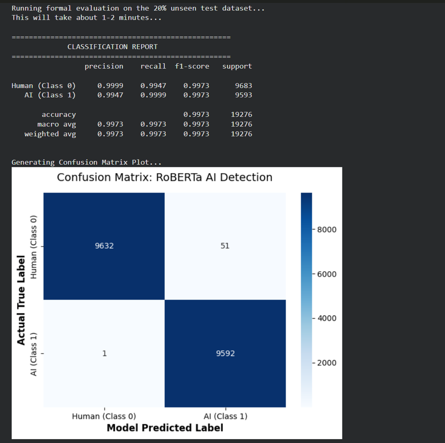

# 🤖 AI Text Detection using RoBERTa

## 📌 Project Overview

This project is an **AI Text Detection System** built using the **RoBERTa model**.
It classifies whether a given text is **AI-generated or human-written**.

---

## 🚀 Features

* Detects AI-generated content
* High accuracy (~99%)
* Based on advanced NLP model (RoBERTa)
* Simple and easy-to-use interface

---

## 🧠 How It Works

1. **Input Text** is given by user
2. Text is **tokenized** into smaller units
3. Tokens are passed into **RoBERTa model**
4. Model processes using deep learning
5. Output is classified as:

   * AI Generated
   * Human Written

---

## 🛠️ Tech Stack

* Python
* Transformers (Hugging Face)
* Machine Learning
* Natural Language Processing (NLP)

---

## 📊 Results

* Achieved **~99% accuracy**
* High precision and F1-score

---

## 📸 Output Screenshot



---

## 📂 Project Structure

```
├── app.py
├── ai_text_detection.pdf
├── output.png
└── README.md
```

---

## 📌 Future Improvements

* Add web interface
* Improve real-time detection
* Deploy as a web app

---

## 🙌 Author

**Mansi Khairnar**
MSc Computer Science Student
